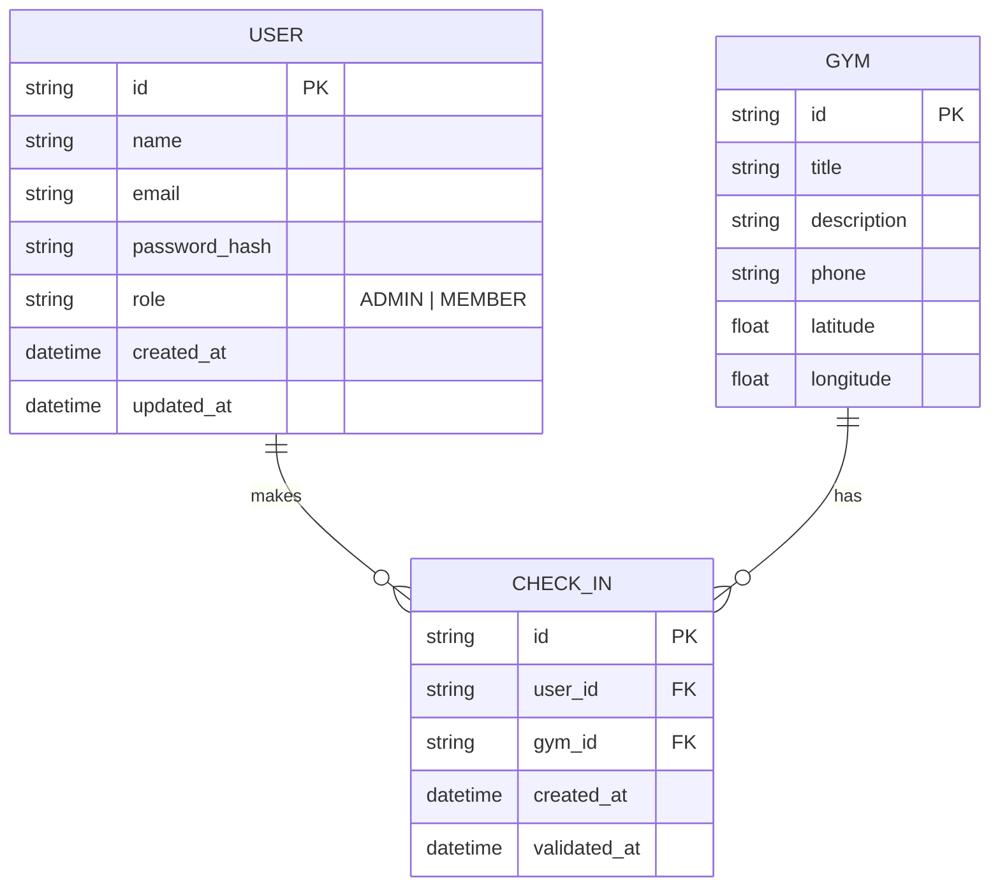
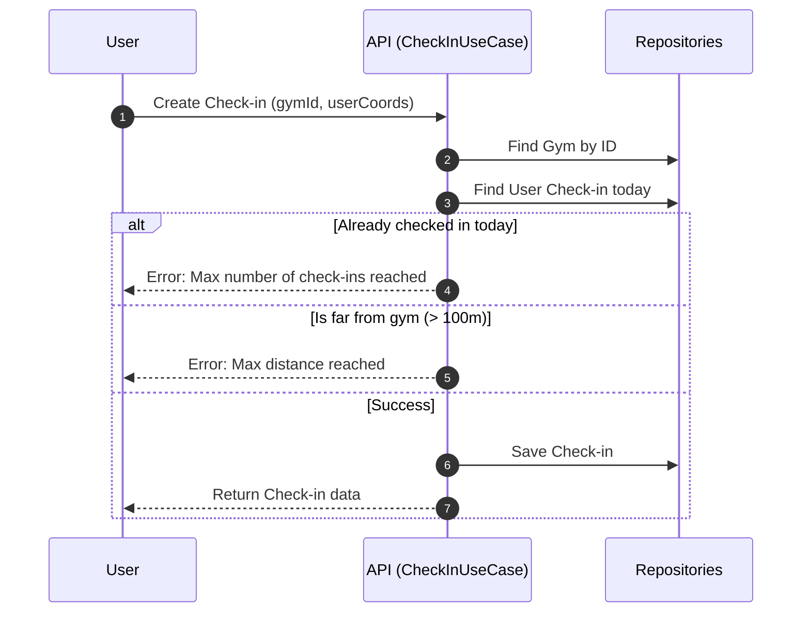
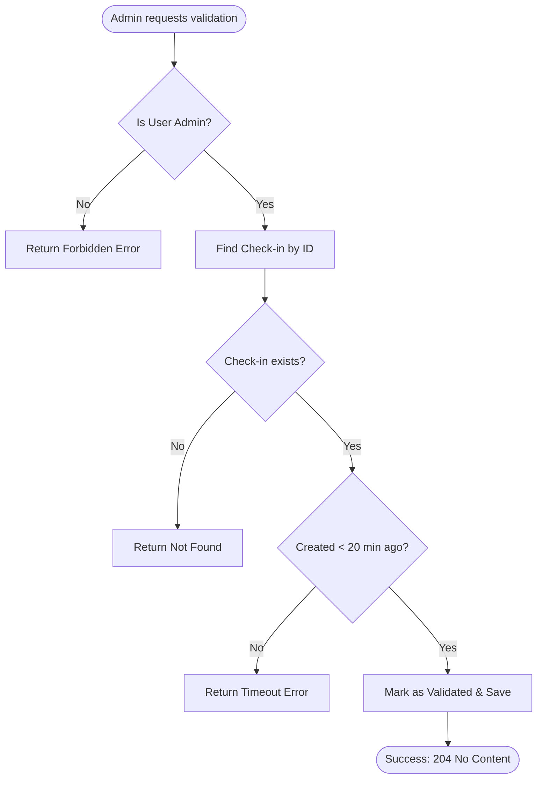

# Architecture and Diagrams

This document contains the visual representation of the system's architecture, database schema, and core business flows.

## Database Schema (ER Diagram)

Representing the relationships between Users, Gyms, and Check-ins.

## Core Flows

### Check-in Process

The check-in flow includes several business rules like distance verification and "one check-in per day" limit.

### Check-in Validation

Validation can only be performed by administrators and within a specific timeframe.

## Project Structure

The project follows a modular structure inspired by Clean Architecture:

- `src/domain`: Business entities and repository interfaces.
- `src/application`: Use cases and business logic.
- `src/infra`: External concerns like Database (Prisma), HTTP (Fastify), and Factories.
- `src/util`: Pure utility functions.
- `test`: E2E integration tests.

## Observability

The project implements distributed tracing and structured logging to ensure the system is observable and easy to debug.

- **OpenTelemetry**: Integrated with Fastify and Prisma to export traces. It captures the entire lifecycle of a request, including database queries.
- **Pino**: Used for structured logging, providing high-performance and machine-readable logs.

## API Documentation

We use **Swagger (OpenAPI)** along with **Scalar** to provide a modern and interactive documentation interface.

- **Endpoint**: `/docs`
- **Features**: Automatic schema generation from Zod types, interactive request testing, and clear visual representation of all available routes.
